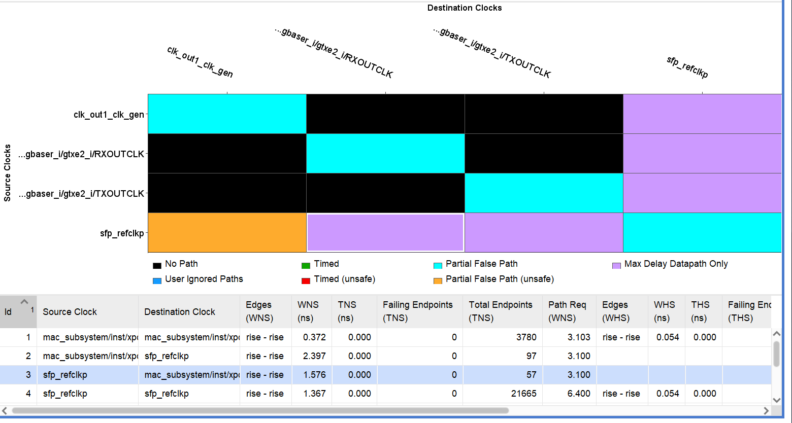

# 10G Ethernet introduction

[TOC]

## OSI七层模型

​      OSI定义了网络互连的七层框架（物理层、数据链路层、网络层、传输层、会话层、表示层、应用层），即ISO开放互连系统参考模型。如下图。

​      每一层实现各自的功能和协议，并完成与相邻层的接口通信。OSI的服务定义详细说明了各层所提供的服务。某一层的服务就是该层及其下各层的一种能力，它通过接口提供给更高一层。各层所提供的服务与这些服务是怎么实现的无关。

（*important**）

​	传输层的作用就是将应用层的数据进行传输转运。比如我们常说的tcp（可靠的传输控制协议）、udp（用户数据报协议）。传输单位为报文段。

　　tcp（Transmission Control Protocol）面向连接（先要和对方确定连接、传输结束需要断开连接，类似打电话）、复杂可靠的、有很好的重传和查错机制。一般用与高速、可靠的通信服务
　　udp（user datagram protocol面向无连接（无需确认对方是否存在，类似寄包裹）、简单高效、没有重传机制。一般用于即时通讯、广播通信等

​	网络层用来处理网络中流动的数据包，数据包为最小的传递单位，比如我们常用的ip协议、icmp协议、arp协议（通过分析ip地址得出物理mac地址）。	

​	数据链路层即MAC层， MAC子层处理CSMA/CD算法、数据出错校验、成帧等；LLC子层定义了一些字段使上次协议能共享数据链路层。 在实际使用中，LLC子层并非必需的。（*mac层负责将udp数据包包装成以太网数据包*）

​	物理层通过phy芯片来实现，目的是将用户数据转换为串行数据发送给RJ45接口（包含数据的编解码）。

​		

## overview

​	硬件平台基于xilinx的官方开发板kc705.以下为本实验的原理框图，实现了 UDP 发送与接收，IP 层发送与接收，MAC 层发送与接收，ARP，ICMP 等功能，其中用户接口为 AXIS 流接口。（实验参考黑金的万兆以太网实验）

​	下面为 10G MAC 的原理框图，可以查看 pg157 文档。其中发送部分、接收部分都是 AXI 流

接口，数据宽度为 64 位。同时还有 AXI4-Lite 接口，用于配置 MAC 寄存器等。我们关注的重点

主要是数据传输接口，也就是发送和接收部分。

​		工程架构如下：

​		udp_test-------------------------------------------------------顶层模块。负责处理接口的发送核接受以及模式选择

​						axis_reset_gen----------------------------------------------复位桥，用于所有模块的复位，避免亚稳态

​						clk_gem-------------------------------------------------------时钟模块，负责生成100MHz的内部测试时钟

​						udp_read_write---------------------------------------------内置fifo缓存，负责生成card向主机发送的数据。

​						udp_ip-----------------------------------------------------------udp协议转换，负责将用户数据转换为																											10g_ethernet的数据接口接受的数据。完成udp																											组包

​						axi_10g_ethernet_0_axi_lite_sm-------------------------负责处理axi-lite的寄存器读写。

​						axi_10g_ethernet---------------------------------------------xilinx提供的10G以太网ip。

### Tx defination：

​		从上表中也可以看到，AXIS 接口可以配置为 64 位或 32 位，是在配置 IP 核的时候进行选择

的。根据不同的数据宽度，参考时钟频率也不同，在文档里也可以看到，64 位时钟为 156.25MHz，

32位时钟为312.5MHz。在本实验中我们使用64位的数据，其带宽也就是156.25M*64bit=10Gbps。

由于 10GBASE-R 是 64b/66b 编码，因此收发器的速度为 10Gbps*66/64 = 10.3125Gbps。

​		以下为 64 位发送端正常模式下的时序，其中的 DA 为 destination mac address，即目标 MAC

地址；SA 为 source mac address，即源 MAC 地址；L/T 为 length/type 信息，即长度或类型；D 

为数据信息。可以看到正常模式下是不带 CRC 校验的，这部分由 MAC 来完成。

​		一包数据部分长度要求为 46~1500 字节，也就是 D 部分，如果不足 46 字节，MAC 会自动

插入数据到 46 字节。但是如果 MAC IP 被配置成有 FCS 部分，也就是 CRC 校验部分，用户需要

保证数据部分长度满足要求，否则会被 MAC IP 认为是 Bad Frame。本节实验中，采用正常模式，

不加 FCS 部分。

### Rx defination

​	接收部分与发送部分最大的不同是没有了 tready 信号，也就是不需要用户这边提供准备信

号，而是一直不停的接收数据。同时 tuser 指示接收到的包是否正确，用户可以根据此信号判断

包的正确性。

​	以下是 64 位接收到正确包的时序图，可以看到是在 tlast 有效时，tuser 同时有效，表明此

包是正确的包

​	下面是接收到错误包的情况，在 tlast 有效时，tuser 为低电平。

以下的情况会出现错误包：

 FCS 发现错误

 数据包长小于 64 字节，也就是 DA(6)+SA(6)+L/T(2)+D+FCS(4)的长度，其中 D 的长度要大于

等于 46 字节。

 没有使能巨型帧的情况下，接收到巨型帧

 数据包长度大于 MTU 要求

还有其他一些情况也会出现错误，这里就不在列举了，详情可以参考 pg157 文档。

同样，接收部分也有是否插入 FCS 的配置，在本实验中采用默认的正常模式，不插入 FCS。

### State indicate

​	在实验中我们会用到 pcspma_status 的状态指示，其中 bit0 用于指示 PCS 模块已经 lock。

### Register configuration

​		在文档中也介绍了很多的寄存器，这些寄存器都是通过 AXI4-Lite 总线配置的，具体的寄存

器说明请参考 pg157 文档。

## Build flow

### Add 10g Ip

​		在 IP Catalog 中搜索 10g，找到 10G Ethernet Subsystem，双击

​		其实这个一个模块是由 MAC 和 PCS/PMA 共同组成的，10G Ethernet MAC 实现 MAC 功能，10G Ethernet PCS/PMA 实现收发器的数据传输。同时可以看到从逻辑上看，分为 Core Level Logic，也就是核心的逻辑，另外就是 Shared Logic，主要是时钟部分，可以共享给其他的核使用。

​		打开之后，首先配置 AXI4-Stream 的数据宽度，前面讲过，配置为 64bit

​		在 MAC Options 中配置 AXI4-Lite 总线的时钟频率为 100MHz，可以看到时钟要求是10-300MHz，其他选项取消掉。

​		在 PCS/PMA Options 中，配置 DRP 时钟也为 100MHz，DRP 是 MAC 与用户之间的接口，但我们并没有使用。

​		IEEE1588 Options 一栏保持默认.

​		Shared Logic 一栏，选择“Include Shared Logic in core”，指的是共享逻辑包含在 core 内。之后点击 OK，并生成 Output Products

### Add Udp ip

​		在工程目录下，有个 ip_repo 文件夹，里面存放了 10g udp 的自定义 IP

​		点击 IP Catalog，在 Vivado Repository 右键选择 Add Repository

​		选择 ip_repo 文件夹路径，之后出现窗口，点击 OK.

### Introduce

axi_10g_ethernet_0_sync_reset:	

​			用于从一个时钟域到另一个时钟域的信号，这是一个多触发器管道，所有触发器一起放置在同一个slice			中。因此，两者之间的路由延迟是最小的，以防止亚稳态问题.这个模块需要通过配置寄存器来启动10g  			mac这个ip的工作。通过这个部分需要掌握的寄存器如下：

​		    寄存器描述：

| Address | Description                    |
| :------ | ------------------------------ |
| 0x500   | MDIO Configuration Word 0      |
| 0x404   | Receiver Configuration Word 1  |
| 0x408   | Transmitter Configuration Word |
| 0x504   | MDIO Configuration Word 1      |
| 0x508   | MDIO TX Data                   |
| 0x50C   | MDIO RX Data (read-only)       |

​		AXI4-Lite接口用于访问核心上的MDIO端口，并访问外部设备中的PHY寄存器，或同一FPGA上的关联软核中的PHY寄存器。由于MDIO接口是一个相对较慢的双线接口，MDIO访问可能需要许多AXI4-Lite周期才能完成。
​		在进行任何MDIO访问之前，必须向MDIO配置字0寄存器写入有效的时钟分频值并设置MDIO使能位。
​		PHY寄存器访问的目标由MDIO配置字1寄存器中的PRTAD和DEVAD字段的值设置。在此子系统中，5位MDIO PRTAD始终固定为0。
​		要写入PHY寄存器，首先必须设置寄存器地址，然后执行第二个事务以从该地址写入值。这是通过在MDIO配置字1中设置目标端口和设备地址，设置MDIO TX Data寄存器中的目标寄存器地址，将MDIO配置字1的TX OP字段设置为ADDRESS并启动事务来完成的；然后将MDIO TX Data寄存器设置为要写入的数据，将TX OP字段设置为WRITE并启动后续事务。

​		要从PHY寄存器中读取数据，首先必须设置寄存器地址，然后执行第二个事务以从该地址读取值。这是通过在MDIO配置字1中设置目标端口和设备地址，设置MDIO TX Data寄存器中的目标寄存器地址，将MDIO配置字1的TX OP字段设置为ADDRESS并启动事务来完成的；然后将TX OP字段设置为READ并启动后续事务，并从MDIO RX Data寄存器中读取结果。

​		如果要读取同一PHY地址空间中的连续寄存器，则可以使用协议的特殊读取模式。首先，应按上述方式设置读取地址，但对于第一个读取操作，应将Post-Read-Increment-Address操作码写入MDIO配置字1的相应字段中。这返回如上所述的读取值，并且还具有将读取地址移动到PHY中下一个寄存器值的副作用。
因此，依次重复相同的操作码会从PHY中连续的寄存器地址返回数据。表3-11提供了使用MDIO向端口0上的10GBASE-R PCS写入PHY寄存器的示例。

​		这个模块可以直接在ip中的example中获取，分析：

​	

clk_gen:

​			产生所需要的100MHz核50MHz时钟。

Udp_read_write_ctrl ： 

​			主要是实现用户功能，实现了两种模式的切换，一种是 loopback 模式，也就是上位机向开发板发送数据，			开发板再把接收到的数据发送回去；另外一种就是测速模式，开发板持续向 10G 设备发送数据包；两种模			式通过按键进行切换.

axi_10g_ethernet_0_axi_lite_sm：

​			是从 10g mac 的 example 工程中得来的，功能是配置 MAC，不需要改变，直接拿来用即可。这个模块负			责使以太网核心能够在两个方向上实现基本的数据包传输。该模块通过断言 enable gen输出来表示配置完			成，一旦核心处于块锁定或设置为环回模式。

udp_test ：

​			对于 udp_ip 的例化时，设置本地的 ip 地址，也就是开发板的 IP 地址为192.168.0.2，本地的 MAC 地址为 			000a3501fec0，目的 IP 地址设置为 192.168.0.3，源端口和目的端口都设置为 8080。用户接口分为接收			与发送，全都是 AXI4 流接口，同样 MAC 接口也是 AXI4 流接口，与 10G MAC 对接。

## Timing Constraints

​	在生成bit后会发现建立时间裕量小于0。这里为了程序的稳定运行，需要添加相关的约束。

​	打开约束界面，可以发现基本的时钟约束软件都已经添加。（因为是以板卡文件配置的）

​	接下来打开时序报告。

​	打开失效的时序路径。这里只有5条路径是失效的。打开path128。

​	结合电路图可知这两个触发器的时钟非同源时钟。这里需要添加异步时钟组约束。

​	打开`Report Clock Interaction`图中紫色的区域即为异步时钟组。每个异步时钟组在表格中都有对应的原时钟和目的时钟，在这里添加约束即可。

​	以3号为例：鼠标右击并且选择Set Clock Groups，先给时钟组取个名字。原时钟和目的时钟软件都已经选择完毕。直接点击ok即可。 

​	在设置完所有的异步时钟组后继续微调。以path21为例。这是同源时钟，但是中间的组合逻辑级数太多。需要做周期约束。

​	可以发现这里组合逻辑跨了五级（5个lut）。设置周期数为2用于建立时间收敛，周期数为1用于保持时间收敛。做完之后可以发现路径明显收敛。

​	对于保持时间的违例目前先不解决，等到implementation之后再解决。

​	继续微调。path93为例：查看路径报告以及原理图。之前设置过异步时钟组约束，但是setup依然小于0.这里针对setup需要再做一个max delay。

​	

​	查看路径报告，这里再将它延迟8个ns。

​	做完这一步可以发现setup此时满足要求。

​	完成以上步骤后Run Implementation。查看hold time是否违例。此时系统会针对hold没过的路径自动添加lut增加延迟完成时序闭合。所以hold的违例在Synthesis这一步后没必要去做。hold没过无非满足以下三个条件：

## Verify

